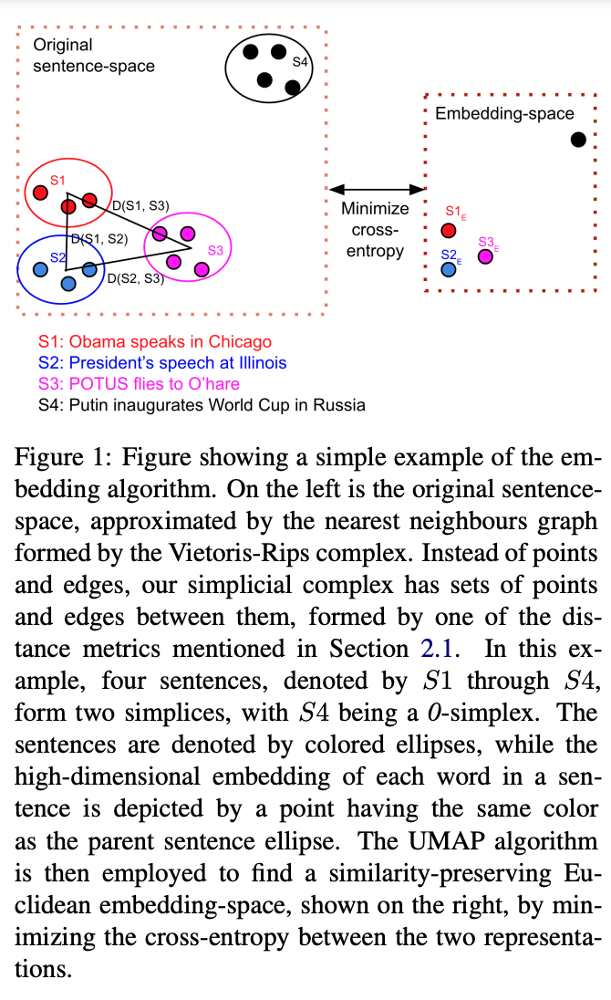

Code the paper titled `Unsupervised Sentence-embeddings by Manifold Approximation and Projection` published at EACL 2021 (arxiv link) by Subhradeep Kayal.



## Citation
If you find this paper useful for your research, please consider citing the paper:

```
@inproceedings{kayal2021eacl,
  title={Unsupervised Sentence-embeddings by Manifold Approximation and Projection},
  author={Kayal, Subhradeep},
  booktitle={Proceedings of the 16th Conference of the European Chapter of the Association for Computational Linguistics, {EACL} 2021},
  year={2021}
}
```

## Installing dependencies
- all the dependencies have been explicitly mentioned in `requirements.txt`
- to prepare the environment, run `prepare-server.sh`
- this will:
	- install python2 and 3
	- install swig
	- create and activate a virtual environment named `distemb`
	- install the packages in `requirements.txt`
	- install this particular package
	- create necessary folders
	- fetch the `GoogleNews-vectors-negative300.bin.gz` corpus
	- `make` the emd package

## To run all experiments
- go to /lib/shell
- run, in order:
    - `calc_wmd_dist.sh`
    - `calc_all_dist.sh`
    - `calc_all_embeddings.sh`
    - `calc_all_dct.sh`, `calc_all_eigensent.sh`, `calc_all_powermeans.sh`, `calc_all_sbert.sh` can be run in any order
    - `evaluate_all.sh`
